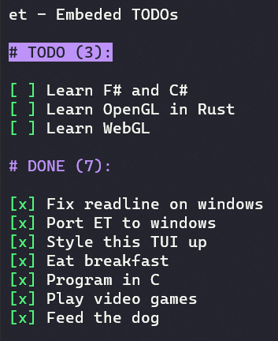

# et - Embeded TODOs

This is a simple TODO manager with a twist.
Its outputs get get saved to markdown file of your choosing, but only take up a defined section.

It uses ncurses for drawing TUI.


## Example TODO list managed by *et*:

<!-- TODOS -->

**TODO (3):**

- [ ] Learn F# and C#
- [ ] Learn OpenGL in Rust
- [ ] Learn WebGL

**DONE (5):**

- [x] Style this TUI up
- [x] Eat breakfast
- [x] Program in C
- [x] Play video games
- [x] Feed the dog
<!-- ENDTODOS -->

How it looks in the app:



## Get started

Install ncurses and gcc.

```console

./make.sh
./et README.md

```
